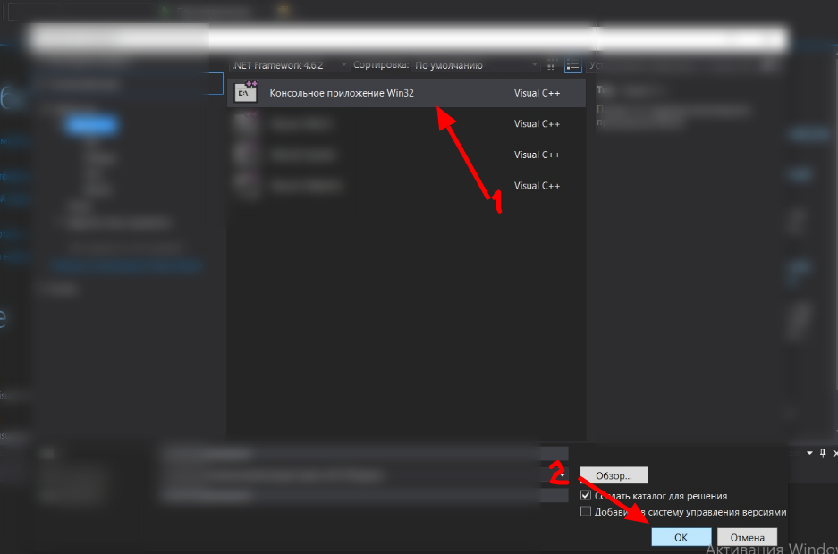
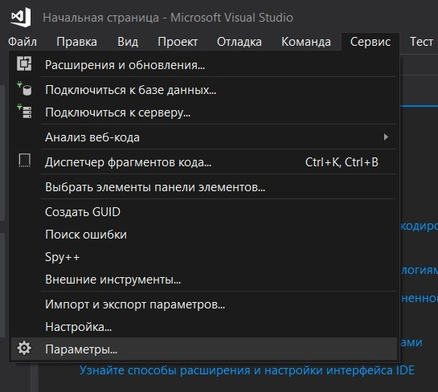
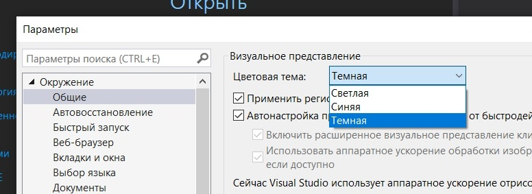
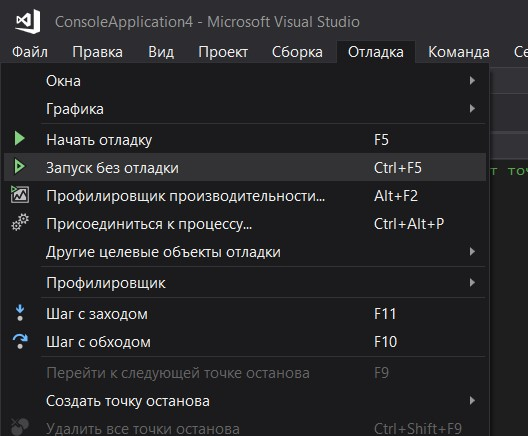
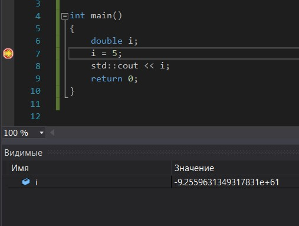

МИНИСТЕРСТВО НАУКИ  И ВЫСШЕГО ОБРАЗОВАНИЯ РОССИЙСКОЙ ФЕДЕРАЦИИ  
Федеральное государственное автономное образовательное учреждение высшего образования"КРЫМСКИЙ ФЕДЕРАЛЬНЫЙ УНИВЕРСИТЕТ им. В. И. ВЕРНАДСКОГО"  
ФИЗИКО-ТЕХНИЧЕСКИЙ ИНСТИТУТ  
Кафедра компьютерной инженерии и моделирования
<br/><br/>

### Отчёт по лабораторной работе № 1<br/> по дисциплине "Программирование"
<br/>
студента 1 курса
<br/>
группы ПИ-б-о-191(1)
<br/>
Пихтиенко Дарьи Владиславовны
<br/>
направления подготовки 09.03.04 "Программная инженерия"  
<br/><br/>


<table>

<tr><td>Научный руководитель<br/> старший преподаватель кафедры<br/> компьютерной инженерии и моделирования</td>

<td>(оценка)</td>

<td>Чабанов В.В.</td>

</tr>

</table>

<br/><br/>
Симферополь, 2019

Цель: изучить основные возможности создания и отладки программ в IDE MS Visual Studio.
<br/><br/>
Ход работы
<br/>**1.** Как создать консольное приложение С++;     
 
 В Visual Studio выберете Файл>Создать>Проект
 <br/> ***рисунок №1 Создание проекта***
 
 <br/><br/>
 Затем в открывшемся окошке выбираем пункт **"Консольное приложение"** и нажимаем **Ок**,для создания проекта.
 ** <br/> ***рисунок №2 Создание проекта***<br/><br/>
 **2.** Как изменить цветовую схему (оформление) среды;<br/><br/>
 Для того, чтобы изменить фон в Visual Studio необходимо в строке меню нажать кнопку “Сервис”, затем выбрать пункт “Параметры”.
 </br>***рисунок №3 Изменение темы***<br/><br/>
 В открывшемся окне в левом столбце выбираем группу “Общие” и теперь при помощи пункта “Цветовая тема” меняем тему.
 </br>***рисунок №4 Изменение темы***<br/><br/>
 **3.** Как закомментировать/раскомментировать блок кода средствами VS;<br/><br/>
Для того что бы закоментировать часть кода в Microsoft Visual Studio необходимо ее выделить и нажеть сочетани клавиш Ctrl+K, Ctrl+C.<br/>
 </br>***рисунок №5 Закомментированный блок кода***<br/>
 Для раскоментирования выделенного текста нужно нажать Ctrl+K, Ctrl+U.<br/><br/>
 **4.** Как открыть в проводнике Windows папку с проектом средствами VS;<br/><br/>
 Для открытия папки с проектом находясь в VS необходимо нажать сочетание клавиш Ctrl+O, открывающие проводник Windows. В проводнике 
выбрать необходимый файл и нажать “Открыть”.
</br>***рисунок №6 Открытие в проводнике Windows папки VS***<br/><br/>
 **5.** Какое расширение файла-проекта используется в VS;<br/><br/>
 В Microsoft Visual Studio 2019 для файлов-проектов используется расширение “.vcxproj”, а для решения “.sin”<br/><br/>
 **6.** Как запустить код без отладки;<br/><br/>
 Для запуска кодa без отладки нужно в разделе “Отладка” выбрать пункт “Запуск без отладки”.<br/>
 </br>***рисунок №7 Запуск кода без отладки***<br/>
 Также можно использовать сочетание клавиш Ctrl+F5.<br/>
 
 **7.** Как запустить код в режиме отладки;<br/><br/>
 Для запуска кодa в режиме отладки нужно в разделе “Отладка” выбрать пункт “Начать отладку”.<br/>
 </br>***рисунок №8 Запуск кода с отладкой***<br/>
 Также можно использовать клавишу F5.
<br/><br/>
**8.** Как установить/убрать точку останова (breakpoint);<br/><br/>
Чтобы установить/убрать точку останова в Microsoft Visual Studio, нужно щелкнуть в левом поле рядом с интересующей строкой кода.<br/><br/>
**9.** Создать программу;<br/><br/>
1)Создала программу с предоставленным кодом:<br/>
```C++
#include <iоstream>

int main()
{<br/>
  int i;
  i = 5;
  std::cout << i;
  return 0;
}
```

2)Поставила breakpoint в строчках 6 и 7.<br/><br/>
3)Запустила приложение в режиме отладки с помощью клавиши F5 и, перемещаясь по ходу исполнения команд с помощью кнопки “Шаг с обходом”(F5), проверила значение переменной i в строках 6 и 7.<br/>
</br>***рисунок №9 Отладка и результат программы***<br/>
 В строке 6, переменная i имела значение -858993460, а в строке 7 изменила его на 5.<br/><br/>
 **10.** Создать программу;<br/><br/>
 1)Создала программу с предоставленным кодом:<br/>
```C++
#include <iоstream>

  int main()
{
    double i;
    i = 5;
    std::cout << i;
    return 0;
  }
 ```
2)Поставила breakpoint в строчках 6 и 7.<br/><br/>
3)Запустила приложение в режиме отладки с помощью клавиши F5 и, перемещаясь по ходу исполнения команд с помощью кнопки “Шаг с обходом”(F5), проверила значение переменной i в строках 6 и 7.<br/>
</br>***рисунок №9 Отладка и результат программы***<br/>
 В строке 6, переменная i имела значение -9.2559631349317831e+61, а в строке 7 изменила его на 5.0000000000000000.<br/><br/>
 **Вывод:** Приобрела базовые способы создания и работы(отладки) с программой в Microsoft Visual Studio 2017.
 
